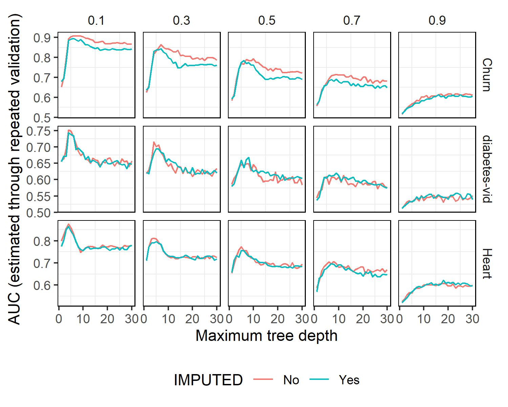

## Ejercicio 2 - Experimento 1

```{r, echo=FALSE, fig.align='center'}
source("./provided_functions.R")
```

En este experimento se analiza como pueden afectar los datos faltantes en un dataset en el rendimiento de un modelo de aprendizaje supervisado.

```{r, echo=FALSE, fig.align='center'}

```

En primer lugar, se destaca (gráfico a cont.) una clara correlación entre la proporción de valores faltantes (NANs) y el rendimiento del modelo. La evidencia gráfica demuestra que a medida que esta proporción aumenta, el valor del área bajo la curva (AUC) disminuye significativamente. Un ejemplo ilustrativo es la comparación entre un 0,1 de NA's en los datos de entrenamiento y una proporción de 0.9, donde el AUC es considerablemente mayor en el primer caso.

En cuanto a la estrategia de manejo de valores faltantes, se observa que el enfoque no imputado, permitiendo que el árbol de decisión gestione los NANs, alcanza el máximo rendimiento AUC en los cuatro escenarios analizados. Esto sugiere que, en estos conjuntos de datos específicos, el manejo de valores faltantes por parte de los árboles de decisión supera a la imputación con medidas como el promedio o la moda.

Otra observación pertinente recae en la profundidad máxima del árbol. En los primeros cuatro escenarios, se alcanza el mejor AUC con una profundidad máxima de alrededor de entre 5 y 10 niveles. Sin embargo, a medida que esta profundidad aumenta, el rendimiento AUC tiende a disminuir, lo cual podría atribuirse a problemas de sobreajuste (overfiting), donde el árbol se adapta demasiado a los datos de entrenamiento y, por ende, presenta un rendimiento deficiente en la predicción.

Una excepción se presenta en los escenarios con una proporción de NA's de 0.9, donde se alcanza el máximo rendimiento AUC en un nivel de profundidad más elevado. Este fenómeno plantea interrogantes sobre la causa subyacente y su relación con la alta proporción de valores faltantes en este caso en particular.

En conclusión, en los tres distintos conjuntos de datos, emerge un patrón claro que muestra una relación evidente:

A medida que la proporción de valores faltantes aumenta, el rendimiento del modelo disminuye, lo cual se refleja en la reducción del valor del área bajo la curva (AUC).

Este fenómeno podría atribuirse a la dificultad que enfrenta el modelo al aprender de manera efectiva cuando se encuentran ausentes una cantidad significativa de valores.

Una hipótesis intuitiva para explicar esta relación es que a medida que la proporción de valores faltantes aumenta, el proceso de aprendizaje del modelo se ve deteriorado.

Por ejemplo, consideremos un escenario en el que en los datos de entrenamiento, se registra que un individuo padece diabetes, pero sus variables de presión arterial y niveles de insulina presentan valores faltantes. En esta situación, el modelo no puede aprovechar esa observación completa para comprender los patrones asociados a las personas con diabetes. Conforme la proporción de valores faltantes aumenta, el modelo se enfrenta a una carencia crítica de información para capturar y relacionar las características característicamente asociadas con la condición en cuestión. En esencia, a medida que la información disponible se vuelve más escasa debido a los valores faltantes, la capacidad del modelo para generalizar y realizar predicciones precisas se ve afectada negativamente.

El modelo lucha por identificar patrones y relaciones en los datos, lo que lleva a un descenso en su rendimiento, como se evidencia en la disminución del valor de AUC.

Por lo tanto, la presencia de una alta proporción de valores faltantes puede limitar la habilidad del modelo para capturar de manera efectiva las relaciones subyacentes y, en última instancia, conducir a un deterioro en su capacidad de predicción.
