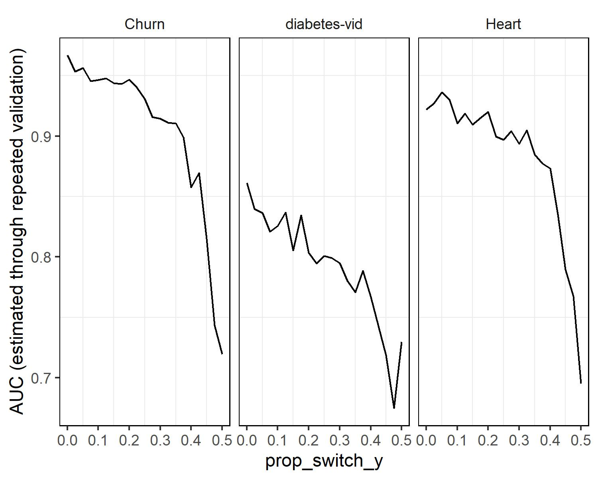

```{r}
source("C:\\Users\\crash\\OneDrive\\Documents\\AI-TP1-pine-town\\exp_4.R")
```

# Experimentos Sugeridos (Opción 4)

El gráfico (a cont.) ilustra una relación clara y coherente entre el incremento en la proporción de valores modificados en una variable de respuesta designada como "noise level", y la correspondiente disminución del valor del "Max Mean AUC". Esto indica que a medida que se aumenta la proporción de valores alterados en la variable de respuesta, se observa un declive gradual en el rendimiento global del modelo, según se refleja en el Max Mean AUC. Esta tendencia sugiere que la introducción de una mayor proporción de valores modificados en la variable de respuesta está directamente relacionada con la disminución de la capacidad del modelo para efectuar predicciones precisas y consistentes.



Una posible explicación para este fenómeno podría radicar en que los valores modificados introducen un nivel de ruido y variabilidad innecesario en la variable de respuesta, lo que dificulta que el modelo identifique patrones significativos y relaciones consistentes en los datos. Como resultado, el modelo podría enfrentar dificultades para generalizar a partir de los patrones genuinos y realizar predicciones coherentes en datos nuevos. Este efecto podría ser especialmente prominente si los valores modificados introducen patrones artificiales que difieren significativamente de los patrones reales presentes en los datos, lo que afectaría adversamente la capacidad del modelo para hacer predicciones confiables.

Una observación adicional de gran relevancia es la marcada caída en el rendimiento del modelo a partir de un nivel de ruido (Noise level) igual a 0.4. Esta abrupta disminución podría atribuirse a la circunstancia de que, en este punto, se estaría modificando cerca de la mitad de los valores en la variable a predecir. Esta situación conlleva a que el modelo aprenda y ajuste sus predicciones utilizando una proporción significativa de valores incorrectos en la variable objetivo. En esencia, al introducir una cantidad sustancial de valores erróneos en la variable de respuesta, el modelo podría estar siendo conducido hacia patrones y relaciones que no son verdaderos en los datos subyacentes. Esto podría derivar en una drástica caída en el rendimiento, ya que el modelo basa sus decisiones en información incorrecta y, por lo tanto, sus predicciones carecen de precisión y validez. Por lo tanto, el punto a partir del cual se observa una declinación significativa en el rendimiento del modelo podría marcar el punto crítico donde la calidad de los datos y la integridad de la variable objetivo comienzan a erosionarse, afectando negativamente la capacidad del modelo para realizar predicciones coherentes y confiables.

En conjunto, la asociación entre un aumento en la proporción de valores modificados en la variable de respuesta y una disminución en el Max Mean AUC apunta hacia la importancia de mantener la integridad de los datos y minimizar la introducción de perturbaciones en las variables de respuesta para preservar el rendimiento óptimo del modelo.
